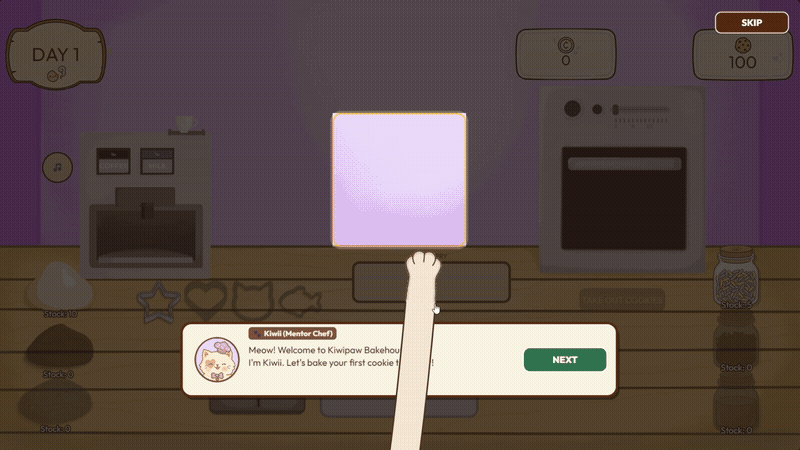
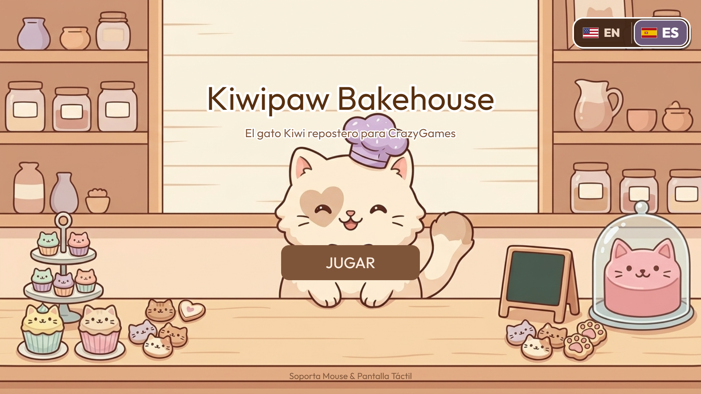
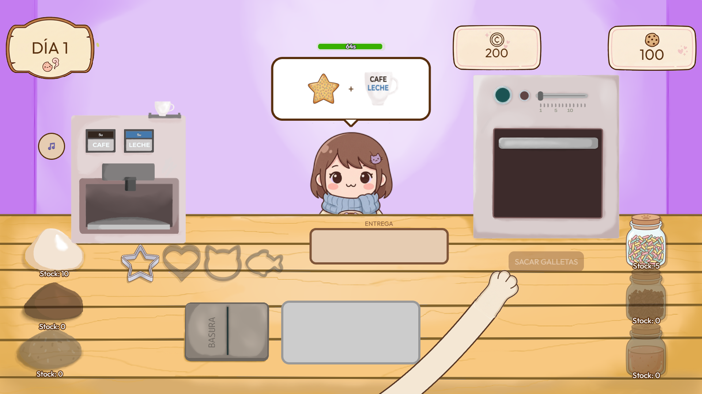
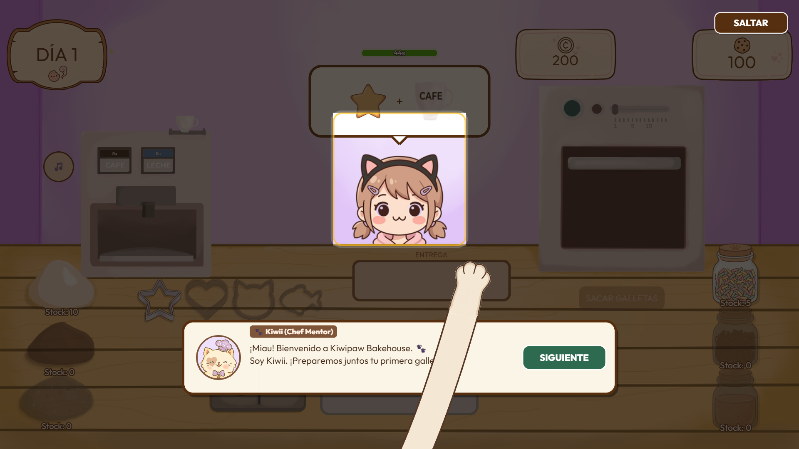

<div align="center">


# 🐱 Kiwipaw Bakehouse
### *Cook Cat Kiwii* — Pastelería Felina Cozy & Gestión Tycoon

**Un michi renunció a su gris trabajo de oficina para cumplir su sueño: abrir una pastelería artesanal. Ayudalo a amasar, hornear, decorar y pagar sus deudas antes de que el banco cierre el negocio.**

[](https://agustcord.github.io/Cook-Cat-Kiwii/)

[](https://agustcord.github.io/Cook-Cat-Kiwii/)


</div>

---

## 🎮 Jugalo en Vivo

👉 **[agustcord.github.io/Cook-Cat-Kiwii](https://agustcord.github.io/Cook-Cat-Kiwii/)**

Ejecuta directamente en tu navegador web (escritorio y dispositivos móviles) con aceleración WebGL y renderizado Canvas nativo, carga instantánea y sin descargas ni registros requeridos.

---

## 🐾 Mi Primer Videojuego

*Kiwipaw Bakehouse* nació como un proyecto con un alcance deliberado y acotado: el desafío de desarrollar un primer videojuego completo de principio a fin en aproximadamente un mes.

La meta principal fue recorrer cada etapa del ciclo de desarrollo independiente, desde la programación del core loop y las mecánicas en Phaser 4 hasta la creación de todo el apartado visual ilustrado a mano en Krita. El resultado es una experiencia sólida, funcional y cuidada, que cumple con el objetivo de dar un primer paso firme en el desarrollo de videojuegos sin perder de vista la jugabilidad y la coherencia estética.

---

## 🎨 Arte 100% Propio e Ilustración Artesanal

Cada elemento visual que ves en pantalla fue **ilustrado digitalmente a mano en Krita**, prescindiendo por completo de bancos genéricos de assets o generadores automáticos. El juego se rige de forma estricta por nuestra **Biblia de Arte** (`art-bible.md`), consolidando una identidad artística propia, orgánica y memorable:

- 🐾 **Estilo Chibi Cozy Orgánico:** Personajes y elementos dibujados con proporciones adorables, líneas suaves y contornos cálidos en marrón chocolate (`#4e3629`), erradicando deliberadamente el negro puro artificial.
- 🎨 **Paleta Pastel Armónica:** Tonos cuidadosamente balanceados para brindar confort visual y evitar fatiga ocular (crema base `#fdfbf7`, trigo tostado `#caa689`, lavanda relajante `#d6c7ff`, rosa fresa `#ffccd5` y madera natural `#ddb892`).
- 🪵 **Mesa y Mostrador Ilustrado al Detalle:** Lienzo interactivo continuo de madera con textura orgánica, diseñado con ergonomía milimétrica para ubicar todas las estaciones de preparación sin colisiones visuales.
- 🖼️ **Pared de Fondo Panorámica 1080p (`fondo_pared.png`):** Fondo nativo Full HD (1920x1080) con iluminación cálida difusa y ambientación pastel.
- 🥐 **Estaciones Interactivas Multicapa:** Horno analógico con cristal refractario reactivo (encendido/apagado), máquina de bebidas humeante, tarros de toppings y cortadores de galletas con volumen visual tangible.
- 🐱 **Patita Felina Táctil y Expresiva:** Cursor diegético animado con cinemática inversa que reproduce el brazo y la garrita del chef gato, reaccionando al toque y al arrastre con animación de agarre (`cat_paw_closed` / `cat_paw_open`).

---

## 🖼️ Galería Visual

### 🎬 Jugabilidad en Vivo
<div align="center">
  
  <p><em>Cinemática de juego en tiempo real: interacción táctil con patita animada, preparación en estaciones y guía interactiva con el Chef Mentor Kiwii.</em></p>
</div>

### 📸 Capturas del Juego en Alta Definición (Full HD 1080p)

| 🏠 Menú Principal Cozy | 🥐 Cocina & Mostrador Artesanal |
| :---: | :---: |
|  |  |
| *Selector bilingüe dinámico [EN \| ES], música sintética y ambientación cálida.* | *Mesa de madera ilustrada en Krita con estaciones de masa, corte, horneado y café.* |

<div align="center">
  <h4>🐾 Pedagogía Lúdica & Tutorial Asistido</h4>
  
  <p><em>Sistema de tutoría en dos fases con input gating estricto, guía direccional y diálogos responsivos que no obstruyen el área de trabajo.</em></p>
</div>

---

## 📖 La Historia

Michi trabajaba como analista en una corporación gris: planillas infinitas, reuniones interminables y un jefe insoportable (*"El Gato Superior"*). Su único refugio era observar, desde la ventana de su cubículo, una cálida pastelería al otro lado de la calle.

Un lunes cualquiera tomó valor: renunció a la oficina, solicitó un **préstamo inicial de 200 monedas** y abrió su propia pastelería. Para conservar su sueño debe hornear contra reloj, satisfacer a clientes exigentes y administrar cuidadosamente sus ingresos diarios para cubrir alquiler, insumos y la cuota del banco.

Si el saldo no alcanza al cerrar el día, el negocio cae en **quiebra**. Si logra sostener la pastelería durante los 4 días y saldar la deuda, *Kiwipaw Bakehouse* será suyo para siempre. 🎉

---

## 🍪 Cómo se Juega: Core Loop de Repostería

Atendés clientes felinos y humanos contra reloj, completando recetas paso a paso a través de las estaciones interactivas:

| Estación | Acción de Juego |
|---|---|
| 🥣 **Masa** | Seleccionás la base de receta (Clásica, Chocolate, Avena). |
| ⭐ **Forma** | Cortás la masa en la bandeja con el molde solicitado (Michi, Huesito, etc.). |
| 🔥 **Horno** | Horneás vigilando el temporizador — ¡cuidado con retirar a tiempo antes de que se queme! |
| 🎨 **Decoración** | Agregás glaseados dulces y toppings de colores según el pedido. |
| ☕ **Cafetería** | Servís bebidas calientes en taza para acompañar los pedidos combinados. |
| 🗑️ **Basurero** | Descartás recetas fallidas o galletas quemadas para liberar la bandeja. |

---

## ✨ Sistemas Avanzados y Avances Recientes

### 🎓 Tutorial Guiado por Bloques con Input Gating (Día 1)
- **Pedagogía en 6 Bloques:** Enseña desde el amasado inicial hasta el empaque final sin sobrecargar al jugador.
- **Input Gating Defensivo:** Bloquea toques fuera de la zona requerida para evitar errores accidentales o pérdida del foco interactivo.
- **Guía Visual en Dos Fases:** Puntero animado de patita que indica origen y destino de cada gesto de arrastre.
- **Bocadillo de Diálogo Responsive:** Posicionamiento inteligente del diálogo del Michi Chef para no tapar la mesa de trabajo.
- **Afianzamiento con Cliente 2 (Bloque 6):** Permite al jugador completar un pedido de forma autónoma antes de liberar el juego libre.
- **Safety Nets:** Recuperación automática ante quemado fortuito de galletas o desvíos de bandeja.

### 📈 Progresión y Rebalanceo Económico
- Curva de dificultad rebalanceada con clientes procedurales, tiempos de paciencia escalonados y pedidos combinados.
- Meta de supervivencia financiera: pagar 200 monedas de deuda en 4 días de gestión.

### 🛍️ Tienda de Mejoras y Nuevas Recetas (`ShopScene`)
- Tarjeta de compras rediseñada con scroll vertical interactivo (rueda de mouse, arrastre y barra deslizante).
- Desbloqueo voluntario y manual de ingredientes y mejoras con las monedas acumuladas.

### 🧾 Pantalla de Balance Fin de Día (`SummaryScene`)
- Recibo contable animado con micro-interacciones.
- Desglose transparente de ingresos por ventas, propinas, costo de insumos, alquiler y cuota del préstamo.
- Calificación de jornada con estrellas doradas reactivas.

### 🎵 Soundscape ASMR y Audio Modular (`SoundManager`)
- Gestor de sonido desacoplado con soporte para feedback acústico: horneado, corte de masa, tintineo de monedas y maullidos.

### 🌐 Soporte Multi-Idioma (i18n)
- Localización completa en Español e Inglés con conmutador interactivo visual en el menú principal.

### 🕹️ Integración CrazyGames SDK v3
- Preparado para publicación en plataformas web con control del ciclo de vida del juego (`gameplayStart` / `gameplayStop`).

---

## 🛠️ Stack Tecnológico e Ingeniería

- **Motor:** [Phaser 4](https://phaser.io/) (v4.2.0 *Giedi*) en resolución nativa 1920x1080 (16:9 Full HD) con auto-escalado `Scale.FIT`.
- **Bundler & Dev Server:** [Vite 8](https://vitejs.dev/) con compilación ultrarrápida.
- **Procesamiento de Sprites:** Pipeline propio en Node.js impulsado por [Sharp](https://sharp.pixelplumbing.com/).
- **Testing Automatizado:** Suite de **454 pruebas unitarias en 112 suites** con el Node.js Test Runner nativo (`npm test`), garantizando máxima estabilidad en la máquina de estados, el tutorial interactivo y el balance económico.
- **CI/CD:** Despliegue automatizado a GitHub Pages vía GitHub Actions en cada actualización a `main`.

---

## 🚀 Instalación y Desarrollo Local

Requisitos: Node.js 20+ y Git.

```bash
# Clonar el repositorio
git clone https://github.com/agustcord/Cook-Cat-Kiwii.git

# Ingresar al directorio
cd Cook-Cat-Kiwii

# Instalar dependencias
npm install

# Iniciar servidor de desarrollo local
npm run dev

# Ejecutar la suite completa de pruebas unitarias (454 tests)
npm test

# Compilar para producción
npm run build
```

---

## 🗺️ Estado del Proyecto y Próximos Pasos

> 🟢 **Beta Jugable de Punta a Punta:** El ciclo completo de juego está operativo (Menú → Días 1 a 4 con tutorial e incremento de dificultad → Pantallas de balance → Tienda → Victoria / Quiebra).

**Próximas metas:**
- Ajustes finos de soporte, layout y experiencia táctil en dispositivos móviles.
- Pequeños retoques y pulido gráfico general.
- Actualización y diseño de la ambientación musical y efectos de sonido (SFX) finales.

---

## 📬 Contacto y Créditos

Creado con 🧉, dedicación y muchas galletas por **[Jonatan Agustín Córdoba](https://github.com/agustcord)**.

*© 2026 — Todos los derechos reservados.*
